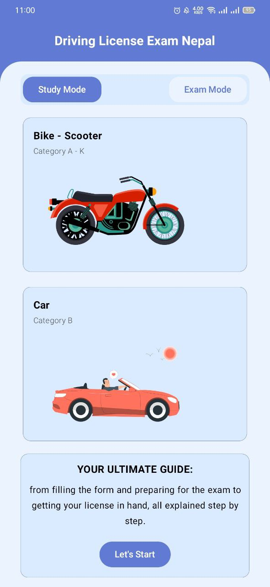
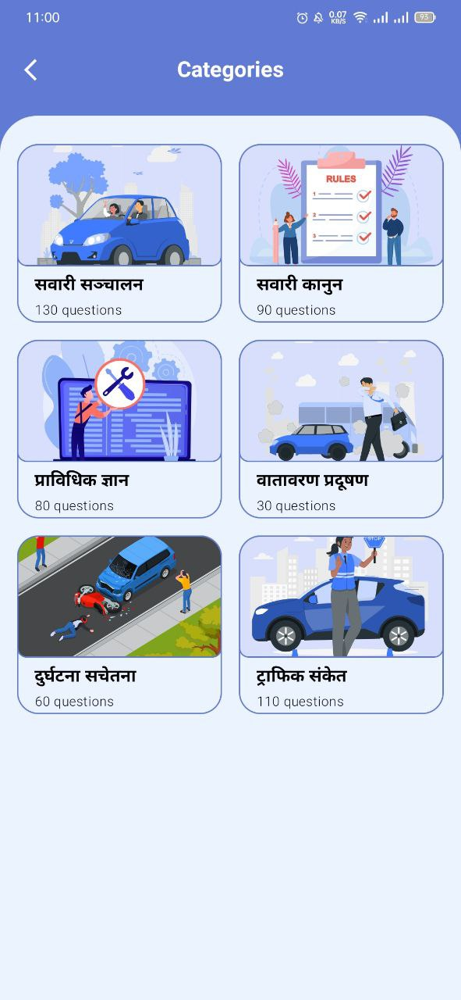
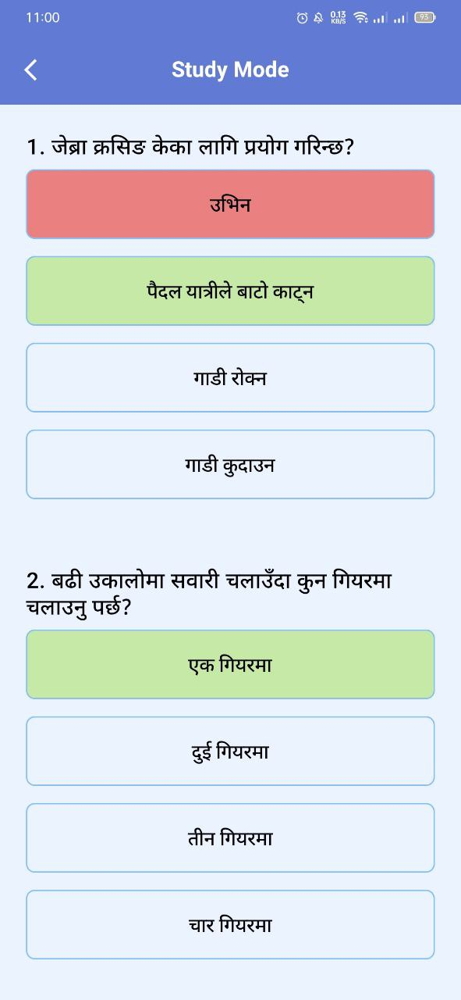
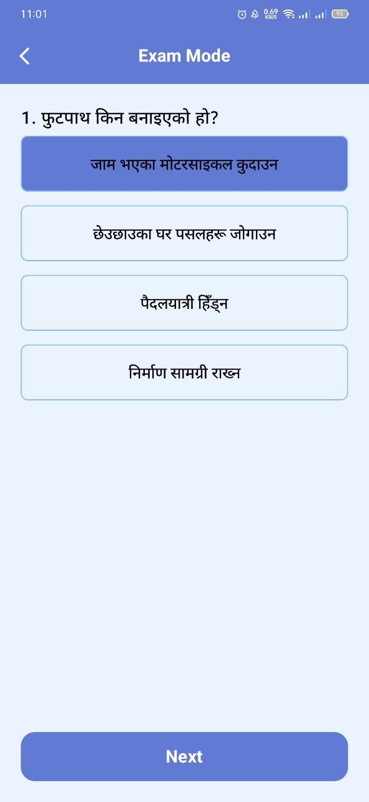
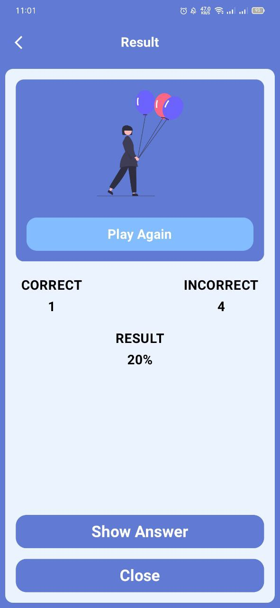
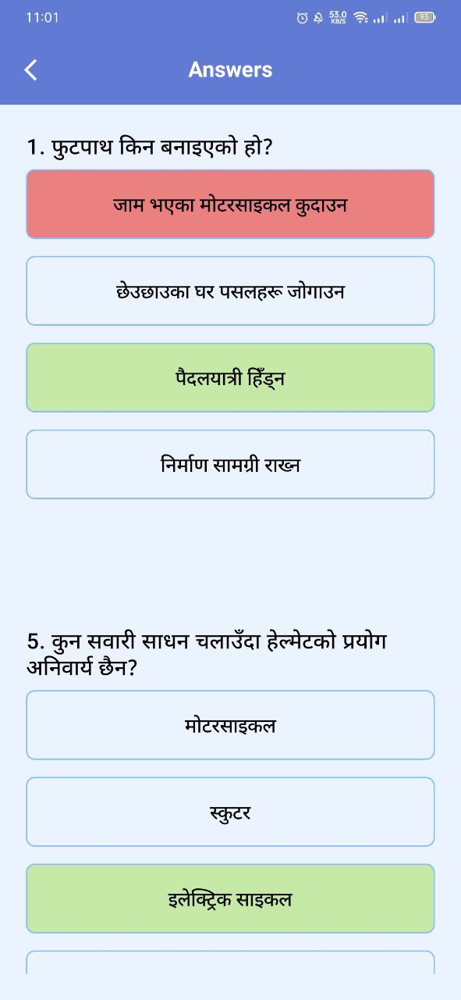
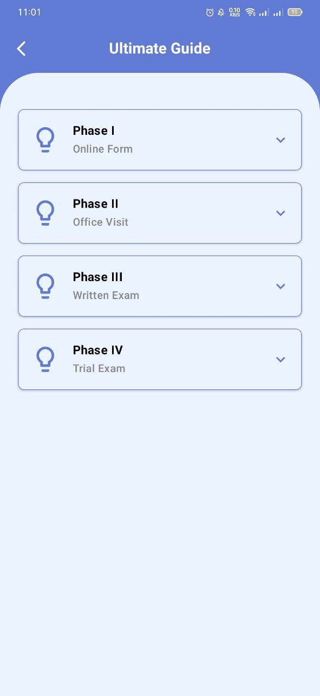

# **Driving License Exam App**
A user-friendly mobile application designed to help individuals in Nepal practice driving license exam questions for bikes, scooters, and cars. 
With an intuitive interface and features like study mode and exam mode, users can effectively prepare for their driving test.
 

## Features

- 🚀 **Offline-First Experience** – Use the app anytime, anywhere.
- 🔓 **Open Source Codebase** – Fully transparent and community-driven.
- 🚫 **100% Ad-Free** – No distractions, just learning.
- 📚 **Comprehensive Question Bank** – Covers Bike, Scooter, and Car exams.
- 🗂️ **Organized Categories** – Questions grouped for structured learning.
- 📖 **Study Mode** – Read and understand questions at your own pace.
- 📝 **Exam Mode** – Simulate real test conditions and track your progress.
- 🏆 **Ultimate Guide** – Step-by-step information on the entire licensing process.
- ✨ **Smooth Animations** – Enhancing user experience with fluid transitions.
- 🌈 **Modern UI & Cool Themes** – Clean, intuitive design with theme customization.  

## Tech Stack

This project was built using the following technologies and tools:

- **Kotlin**: Used as the primary programming language for Android development.
- **Jetpack Compose**: For building modern, responsive, and declarative UI components.
- **Compose Navigation**: Handles navigation between screens within the app.
- **Material Design 3**: Ensures a modern and user-friendly interface.  

## Screens

| Home Screen                      | Category Screen                        | Study Mode Screen                      |
|----------------------------------|----------------------------------------|----------------------------------------|
|  |  |  |

| Exam Mode Screen                      | Result Screen                      | Answer Screen                      |
|---------------------------------------|------------------------------------|------------------------------------|
|  |  |  |

| Ultimate Guide Screen                      |
|--------------------------------------------|
|  |

## Disclaimer

The questions were used from dotm website: https://dotm.gov.np/Files/aa252bb0-c16b-416c-a953-a0a876be69e2_8586.pdf